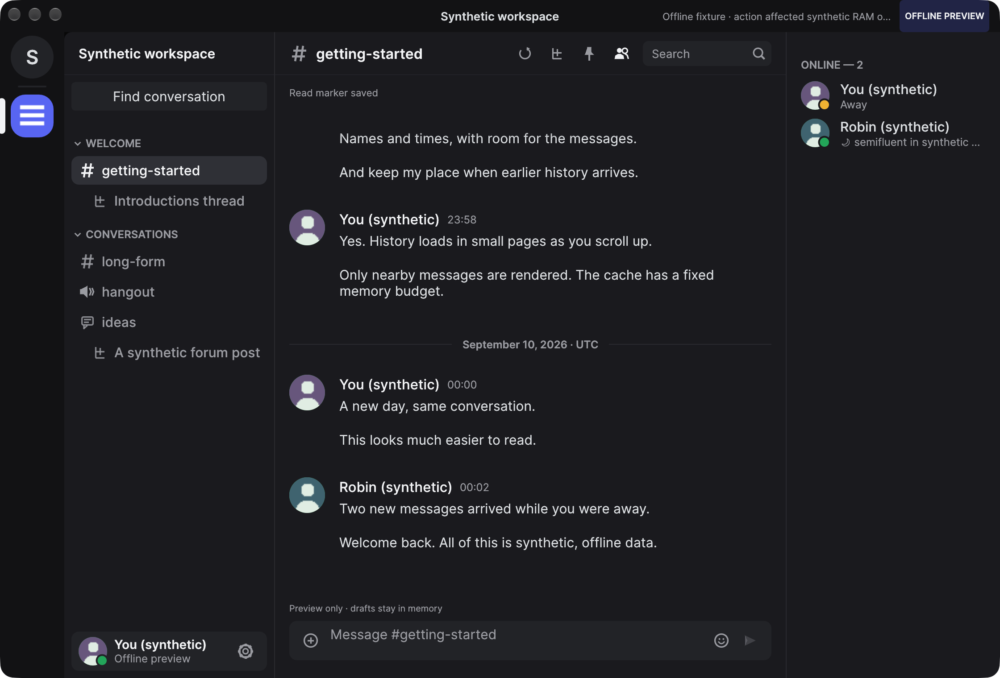

# Serein

<p align="center">
  <a href="https://github.com/ViceVerse-cz/rustcord">
    
  </a>
</p>

<p align="center">
  <strong>A lightweight, native Discord desktop client written in Rust, powered by egui and wgpu.</strong>
</p>

<p align="center">
  <a href="Cargo.toml"></a>
  <a href="crates/ui"></a>
  <a href="docs/platform-support.md"></a>
  <a href="LICENSE-MIT"></a>
</p>

---

> [!WARNING]
> **Experimental, unofficial, and not endorsed by Discord.**
> Serein communicates directly with Discord's public gateway and REST endpoints for your existing account. It is **not** a completed Discord replacement, and the normal-user live message exchange gate has not passed. Automating normal accounts outside the official OAuth2/bot API violates Discord's Terms of Service and carries risk of account termination. Technical interoperability does not imply platform approval. Review the [compatibility matrix](docs/discord-compatibility.md) and [authentication guide](docs/authentication.md) before use.

---

## Highlights

- **Pure Native Performance:** Built with pure Rust and `egui`/`wgpu`. Immediate-mode rendering with minimal idle CPU, low memory footprint, and instantaneous launch times—zero Electron, Node.js, or web messaging runtime.
- **Direct Gateway & REST Transports:** Connects directly to Discord's official endpoints with active rate-limiting cooldowns, heartbeat handling, reconnect/resume loops, and partial payload patching.
- **Secure OS Credential Storage:** Session tokens are stored exclusively in your operating system's secure vault (macOS Keychain, Windows Credential Manager, or Linux Secret Service). Never saved in plaintext.
- **Ephemeral Authentication Webview:** Sign-in uses Discord's official hosted login page inside a temporary native webview (WKWebView, WebView2, or WebKitGTK) supporting email/password, QR login, and MFA. An origin-checked handoff secures the session credential and immediately terminates the webview.
- **Bounded Local Persistence:** Recent chat history, drafts, and media preview indices are stored in an account-isolated, bounded local SQLite database. All local data is strictly cleared upon explicit logout.
- **Native Voice:** Built-in voice engine supporting Opus audio, Discord Voice WebSocket/UDP, DAVE v1 protocol, 1-to-1 DM calls, server voice channels, push-to-talk, and native audio device selection.

---

## Quick Start

### Prerequisites
Rust **1.98.1** is pinned. Ensure you have the standard C/C++ toolchain and CMake installed for your platform:
- **macOS:** Xcode command-line tools (`xcode-select --install`)
- **Linux:** GCC/Clang, ALSA development headers, `pkg-config`, GTK 4, WebKitGTK 6.0, fontconfig, and Vulkan drivers (see [Platform Support](docs/platform-support.md))
- **Windows:** Visual Studio C++ build tools and WebView2 Runtime

### Running Locally

```sh
# 1. Opt in to the offline synthetic demo (no network, no storage)
cargo run --locked --features demo -- --demo

# 2. Launch standard client with voice (uses saved login or official webview)
cargo run --locked
```

### Workspace Commands

```sh
# Run full workspace validation (formatting, Clippy, tests, policy checks)
cargo xtask check

# Run release reducer benchmark
cargo replay

# Run authentication bridge JS test harness
node tests/login-handoff.cjs

# Package release including voice (macOS .app bundle, Linux .deb)
cargo xtask package
```

---

## Feature Matrix

| Capability | Status | Notes |
|---|---|---|
| **Navigation & Guilds** | Implemented | Collapsible server categories, cached icons, guild channels, DM lists, and People pane |
| **Message Timeline** | Implemented | Virtualized variable-height rows, inline link confirmations, and inline spoilers |
| **Markdown Formatting** | Implemented | Bold, italics, code blocks, blockquotes, and clickable inline links |
| **Reactions & Emojis** | Implemented | Native reaction counts, eight-emoji quick picker, add/remove reaction controls |
| **User Mentions** | Implemented | Clickable user mentions with interactive composer autocompletion |
| **Media Previews** | Implemented | Inline image cards, embed cards, full-window image viewer, and explicit downloads |
| **Profile Cards** | Implemented | On-demand service profiles with banners, bios, and account/guild details |
| **Typing Indicators** | Partial | Displays incoming typing with short expiry; Serein **never** emits outgoing typing signals |
| **Persistence & Drafts** | Implemented | Bounded SQLite cache for history and drafts; OS credential store for auth token |
| **Voice Engine** | Built in | DM calls & server channels, Opus codec, DAVE v1, push-to-talk (`V`), device selector |
| **File Uploads** | In Progress | Synthetic pipeline validated; direct client uploads in active development |
| **Screen Sharing** | Experimental sender | macOS 14+ / Windows; source and quality picker up to 1080p60; live Discord viewing unverified |
| **Camera Video / Stream Viewing** | Unimplemented | Planned for future milestones |
| **Internationalization** | Partial | CJK and Arabic font fallbacks included; full IME and bidirectional editing unverified |

> [!NOTE]
> **Voice Scope Notice:** Voice audio currently relies on synthetic protocol and codec tests without physical microphone/speaker verification against live Discord servers. Because acoustic echo cancellation (AEC) is not yet implemented, **always use headphones** when testing voice features.

---

## Architecture Overview

Serein is engineered as a clean multi-crate Cargo workspace, isolating UI rendering from networking, persistence, and service protocols:

```
rustcord/
├── apps/
│   └── desktop/          # Application entrypoint, CLI flags, window lifecycle
├── crates/
│   ├── client-core/      # Client state coordinator, generation tracking, events
│   ├── session-cache/    # In-memory bounded cache and state reconciliation
│   ├── ui/               # egui widgets, message virtualizer, themes, design tokens
│   ├── model/            # Strongly-typed Discord domain entities
│   ├── discord-protocol/ # Wire protocol serialization and partial payload patches
│   ├── discord-api/      # HTTP/2 REST client with rate limiting and backoff
│   ├── discord-gateway/  # WebSocket gateway client with heartbeat and resume
│   ├── discord-voice/    # Opus codecs, RTP/UDP transport, DAVE v1 protocol
│   ├── local-store/      # Bounded SQLite database for history, drafts, settings
│   ├── platform/         # OS credential store (Keychain/CredManager/SecretService)
│   └── test-support/     # Deterministic synthetic fixtures and mocks
└── tools/
    └── replay-bench/     # Benchmarking harness for state reducers
```

---

## Security & Storage Policy

- **Token Protection:** Tokens are saved solely in the native OS credential store (macOS Keychain, Windows Credential Manager, Linux Secret Service). Plaintext token fallback is strictly prohibited. Active tokens remain redacted in memory.
- **Local Cache Bounds:** SQLite databases store recent channel history, drafts, and image preview metadata within bounded byte and count limits. The local SQLite store is **not** encrypted by the application.
- **Sanitary Logout:** Executing an explicit logout destroys active network sessions, purges active secrets from memory, deletes the token from the OS credential store, and erases that account's local cache and drafts.
- **Zero Telemetry:** Serein contains no analytics, telemetry, background crash collectors, or tracking beacons.
- **Platform Integrity:** No fingerprint spoofing, CAPTCHA/MFA bypasses, bot substitutions, token scrapers, or third-party relays.

For full details, review the [Storage Policy](docs/storage-policy.md) and [Threat Model](docs/threat-model.md).

---

## Documentation

- [Architecture & Monorepo Design](docs/architecture.md)
- [Discord Compatibility & Protocol Details](docs/discord-compatibility.md)
- [Authentication & Login Handoff](docs/authentication.md)
- [Storage Policy & Cache Retention](docs/storage-policy.md)
- [Platform Support & Build Requirements](docs/platform-support.md)
- [Voice Architecture & Procedure](docs/voice.md)
- [Performance & Benchmarks](docs/performance.md)
- [Design Tokens & UI Styling](docs/design.md)
- [Third-Party Licenses & Notices](THIRD_PARTY_NOTICES.md)

---

## License

Original Serein code is dual-licensed under either:
- **MIT License** ([LICENSE-MIT](LICENSE-MIT))
- **Apache License, Version 2.0** ([LICENSE-APACHE](LICENSE-APACHE))

at your option. Third-party library notices, bundled font licenses (Inter, Noto Sans CJK/Arabic), and Twemoji graphics licenses are cataloged in [THIRD_PARTY_NOTICES.md](THIRD_PARTY_NOTICES.md).

Demo fixtures and simulated actions are excluded from normal app and CI packages.
Build with `--features demo` and launch with `--demo` to enable them; `--demo-*`
scenario flags additionally require `--demo`. `cargo xtask package` always builds
without demo support, while offline tests can still use synthetic fixtures.
